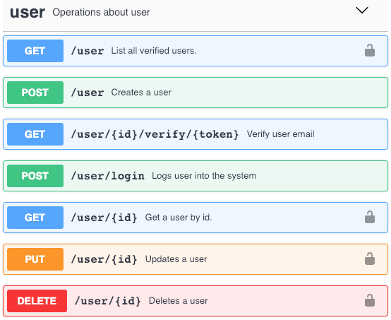

# UpStack - Coding challenge Node.js

_Author: Sergio Vaquero_

Backend REST API for basic users CRUD: registration, email verification, operations authorized based on roles.



Swagger file: `/api/swagger.json`

## How to start the server?

### Requirements

- Git client
- Docker (docker-compose)

### Start the server

```
git clone https://github.com/servaq/upstack-nodejs.git
cd upstack-nodejs
docker-compose up -d
```

## Run the tests

```
docker exec -it upstack-nodejs_server_1 npm test
```

## Play with Postman

Collection: `/api/UpStack nodejs.postman_collection.json`

Ports:

- Server: 3000
- MySQL: 3306

You can change these on `/docker-compose.yml`. Then build and run docker-compose again.

## Stop the server

```
docker-compose down
```

## Technology

- [MySQL 5.6](https://www.mysql.com/products/community/)
- [Express](https://expressjs.com/)
- [Knex.js](http://knexjs.org)
- [Mocha](https://mochajs.org/.js), [Chai](https://www.chaijs.com/), [Supertest](https://github.com/visionmedia/supertest)
- [ESLint](https://eslint.org/)
